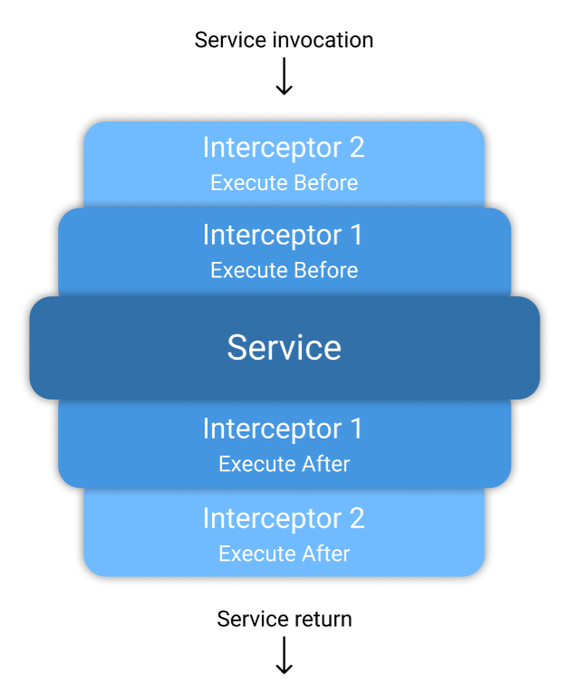

# Interceptr.NET
## Description

With this library you can easily intercept service calls using the .NET's default DI container. That means you can inject code to execute logic before and after a service call.

It is built with source generators in order to only use reflection at compile time as long as it helps to guarantee application's performance and safety.

Another benefit is that you can easily debug the generated code.

## Compatibility
* .NET 6.x
* .NET 5.x

## Getting started

First you need to create your custom interceptors classes. To achieve this you will have to create a new class, give it a beautiful name and implement the **Interceptr.IInterceptor** interface.

For example:

```cs
public class StopwatchInterceptor : IInterceptor
{
    private Stopwatch _sw;

    public void ExecuteBefore(CallContext context)
    {
        _sw = Stopwatch.StartNew();
    }

    public void ExecuteAfter(CallContext context, object result)
    {
        _sw.Stop();
        Debug.WriteLine($"Method {context.MethodName} has taken {_sw.Elapsed.TotalMilliseconds} milliseconds to execute");
    }
}
```

After that you will need to register your dependencies with the one of the three provided extensions methods, passing as parameters your custom interceptor objects:

```cs
services.AddTransientIntercepted<TInterface, TClass>(params IInterceptor[] interceptors);
services.AddScopedIntercepted<TInterface, TClass>(params IInterceptor[] interceptors);
services.AddSingletonIntercepted<TInterface, TClass>(params IInterceptor[] interceptors);
```

There is a point of attention here, the order of interceptors passed to these methods above will affect the execution. 

The first interceptor parameter will execute more closely to the intercepted service, whereas the last interceptor parameter will execute more distant from the intercepted service like that image below.



And thats it, now you're ready to go!

## Contributing
This library is an open-source project, you can contribute by bringing new ideas to discussion at github or reporting bugs. Once a change is accepted, it will be up for grab. Please read more at [CONTRIBUTING](./CONTRIBUTING.md).
